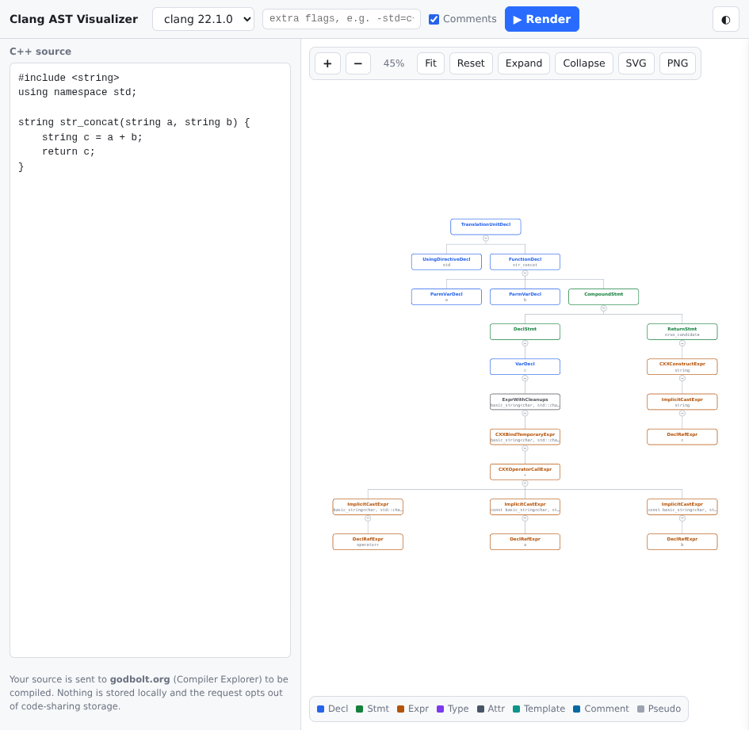

# clang-ast-to-graph

Paste C++ source, get an interactive diagram of its Clang AST.

Open `index.html` in a browser. That's the whole install — it is one self-contained
file with no build step and no dependencies to fetch at runtime.



## How it works

The page sends your source to [Compiler Explorer](https://godbolt.org)'s public API,
which compiles it and returns the AST dump. The page parses that text and lays it out
as a tidy tree.

It uses CE's `produceAst` backend option rather than passing `-Xclang -ast-dump` as a
compiler flag. This matters: the raw flag dumps the *entire* translation unit, which for
a file containing nothing but `#include <string>` is ~54,000 lines — large enough that
the server truncates the response and **your own code gets cut off entirely**.
`produceAst` scopes the dump to your code, so the same file yields 21 lines.

## Privacy

Your source is sent to godbolt.org, a third party, to be compiled. The page needs
network access and requests `allowStoreCodeDebug: false` so the code is not stored for
sharing. If that is not acceptable, don't use this — there is no local-compile mode.

## Using it

- **Compiler** — clang only, since the AST dump format is clang-specific. Defaults to
  clang 22.1.0.
- **Extra flags** — passed through as `userArguments`, e.g. `-std=c++20`.
- **Comments** — on by default; sends `-fparse-all-comments` so comments attached to a
  declaration show up as nodes. Uncheck it to drop back to clang's default, where only
  doc comments (`///`, `/** */`) are kept. Either way, comments in statement position are
  discarded by clang — see *Trivia* below.
- **Click a node** for its source range, types, attributes, and the verbatim dump line.
- **Click a `+N` / `−` badge** below a node to collapse or expand that subtree.
- **Drag** to pan, **scroll** to zoom, or use the **+** / **−** buttons; the readout shows
  the current zoom. **Fit** frames the whole tree, **Reset** returns to 100%.
- **SVG / PNG** export the current tree. PNG is capped at 16,384px and scales down
  rather than silently producing a blank image.

Node colors follow the AST class: Decl, Stmt, Expr, Type, Attr, Template, and a muted
"pseudo" style for lines that aren't real nodes (`<<<NULL>>>`, base specifiers like
`public 'BaseA'`, `DefinitionData`, `Overrides:`).

## Development

```
node tools/check-parser.mjs                  # parser test suite
some-dump | node tools/check-parser.mjs --stdin   # assert every line becomes a node
```

The parser lives inside `index.html` between the `PARSER_START` / `PARSER_END` markers;
the test runner extracts and evaluates that block, so there is no second copy to drift.

`samples/` holds fixtures generated from real clang output:

| file | covers |
|---|---|
| `expected-ast.txt` | golden `produceAst` output for `samples/sample.cpp` |
| `edge-cases.txt` | `<<<NULL>>>` placeholders, `'<<='` operators, shift expressions |
| `forest.txt` | multi-root `Dumping x:` blocks, `public`/`private` bases, `Overrides:` |
| `comments.txt` | doc-comment nodes with hostile text (see below) |

### Things the parser has to get right

Verified against 53,994 lines of real clang output (every line becomes exactly one node):

- **Indentation** is a run of 2-char groups from `{"| ", "  "}` ending in `|-` or `` `- ``.
  Depth is `prefix_length / 2`.
- **Angle brackets can't be matched naively.** Types contain them
  (`basic_string<char, …> (*)(const … &)`), operators are printed as quoted text
  (`'<<'`, `'<dependent type>'`), and ranges nest (`<<invalid sloc>>`). Matching is
  bracket-depth counted and quote-aware.
- **Node addresses are optional** — `produceAst` strips them from nodes but keeps them
  on referenced decls.
- **Sugared types** print as `'string':'std::basic_string<char>'` and split into two atoms.
- **Not every line is a node**: `<<<NULL>>>`, `public`/`private`, `original`,
  `inherited from`, `Overrides:`, `DefinitionData` and its children.
- **Trivia.** Unlike Roslyn's full-fidelity C# syntax trees, Clang's AST is semantic and
  lossy: whitespace is gone, and comments survive *only when attached to a declaration*.
  Clang alone keeps just doc comments (`///`, `/** */`); this tool sends
  `-fparse-all-comments` by default (the **Comments** checkbox) so any comment adjacent to
  a declaration is kept too. A comment in statement position is discarded either way:

  ```cpp
  /// doc on the function          -> FullComment under FunctionDecl
  int f(int x) {
      // free-floating comment     -> discarded
      int y = x; // on a decl      -> FullComment under VarDecl
      return y;
  }
  ```

  The flag name oversells it. `clang/Basic/CommentOptions.h` defines it as:

  ```cpp
  /// Treat ordinary comments as documentation comments.
  bool ParseAllComments = false;
  ```

  It does not retain comments generally — in `RawCommentList.cpp` it lowers the minimum
  comment length from 3 to 2 (so `//` qualifies, not just `///`) and promotes ordinary
  comments into the *documentation* comment machinery. That machinery is a side table on
  `ASTContext` **keyed by declaration**, so a comment with no declaration to attach to has
  nowhere to live. That is the whole reason free-floating comments are unrecoverable, and
  it is not something another clang mode fixes — see *clang's experimental syntax tree*
  below, which drops comments as well.

  Attached comments become real nodes (`FullComment` > `ParagraphComment` > `TextComment`),
  and their payload is **double**-quoted and unescaped. A real line from `comments.txt`:

  ```
  TextComment <col:20, col:57> Text="> and 'quotes' and "doubles" and don't"
  ```

  That single line carries a bare `>`, balanced single quotes, nested unescaped double
  quotes, and a stray apostrophe. Quote tracking therefore covers `'` **and** `"`, or
  the `<` in `Text="<angle"` gets read as the start of a bracket group and swallows the
  rest of the line. Dumps with CRLF endings and trailing spaces are also tolerated.

### Aside: clang's experimental syntax tree

LLVM ships a second, less-known tree under `clang/Tooling/Syntax`
(`Tokens.h`, `Tree.h`, `Nodes.h`, `BuildTree.h`). It is reachable from the command line
via `clang-check`, which is part of the `clang-tools` package rather than the compiler:

```
clang-check-21 -syntax-tree-dump  file.cpp -- -std=c++17
clang-check-21 -tokens-dump       file.cpp -- -std=c++17
```

The trailing `--` matters. `clang-check` is a LibTooling tool, so without it it looks for
a `compile_commands.json`, fails to find one, and carries on with *no flags at all*:

```
Error while trying to load a compilation database:
Could not auto-detect compilation database for file "st.cpp"
...
Running without flags.
```

Everything after `--` becomes a fixed compilation database instead, which is what you
want for a standalone file; a real project would point it at a generated
`compile_commands.json`. The flags genuinely apply — compiling structured bindings under
`-std=c++11` warns `decomposition declarations are a C++17 extension`, and under
`-std=c++17` it is clean.

It is a *syntax* tree rather than a semantic one, so unlike `-ast-dump` every token is a
node — punctuation included:

```
TranslationUnit Detached
`-SimpleDeclaration
  |-'int'
  |-DeclaratorList Declarators
  | `-SimpleDeclarator ListElement
  |   |-'f'
  |   `-ParametersAndQualifiers
  |     |-'(' OpenParen
  |     |-ParameterDeclarationList Parameters
  |     | `-SimpleDeclaration ListElement
  |     |   |-'int'
  |     |   `-DeclaratorList Declarators
  |     |     `-SimpleDeclarator ListElement
  |     |       `-'x'
  |     `-')' CloseParen
  `-CompoundStatement
    |-'{' OpenParen
    ...
    `-'}' CloseParen
```

Its real contribution is tracking two token streams and the mapping between them —
*spelled* (what you wrote) and *expanded* (what the parser consumed), which is what makes
macro provenance recoverable:

```
expanded tokens:
  int g ( int a ) { return ( ( a ) + ( a ) ) ; }
  spelled tokens:
    # define TWICE ( x ) ( ( x ) + ( x ) ) int g ( int a ) { return TWICE ( a ) ; }
  mappings:
    ['TWICE'_23, ';'_27) => ['('_8, ';'_17)
```

**It is not a full-fidelity tree.** Verified with clang-check 21.1.8 across all four
combinations of `-fparse-all-comments` and `-C`: comments never appear in the syntax
tree, and are absent from the *spelled* token stream too. For

```cpp
/// doc comment
int f(int x) {
    // free-floating comment
    return x + 1;
}
```

the spelled tokens are `int f ( int x ) { return x + 1 ; }` in every case. Adding an
explicit `-fsyntax-only` changes nothing either (clang-check already installs a
syntax-only adjuster). Whitespace is likewise gone. So it narrows the gap with Roslyn on
punctuation and macros but not on trivia — you still cannot round-trip source from it,
which is why `clang-format` re-lexes instead.

This is a property of the syntax tree, not of broken flag plumbing. In plain clang the
flag plainly works — for `// ordinary comment on a decl` above a function:

```
$ clang-21 -Xclang -ast-dump -fsyntax-only st2.cpp                      # no comment nodes
`-FunctionDecl <st2.cpp:2:1, line:5:1> line:2:5 g 'int (int)'

$ clang-21 -Xclang -ast-dump -fsyntax-only -fparse-all-comments st2.cpp
`-FunctionDecl <st2.cpp:2:1, line:5:1> line:2:5 g 'int (int)'
  `-FullComment <line:1:3, col:29>
    `-ParagraphComment <col:3, col:29>
      `-TextComment <col:3, col:29> Text=" ordinary comment on a decl"
```

`clang-check -ast-dump` with the same flag produces byte-identical output — it wraps the
same frontend — so the comparison against `-syntax-tree-dump` is apples-to-apples rather
than an artifact of the tooling layer.

The flag changes the AST and never the syntax tree, because the doc-comment side table
hangs off `ASTContext` while the syntax tree is built from the lexer's token buffer —
which never carried comments to begin with.

None of this is reachable from this tool: there is no driver flag for it, and Compiler
Explorer's `produceAst` returns the ordinary AST dump.

### Re-vendoring d3-hierarchy

`d3-hierarchy` 3.1.2 (ISC, 14.8 KB minified) is inlined in `index.html` for
`d3.tree()`'s Buchheim tidy layout; `vendor/` keeps the original copy. Pan/zoom is
hand-rolled rather than using `d3-zoom`, which would pull in 8 transitive packages
(~64 KB) to transform one `<g>`. To update:

```
npm pack d3-hierarchy@3.1.2 && tar xzf d3-hierarchy-3.1.2.tgz
cp package/dist/d3-hierarchy.min.js vendor/
```

then replace the fenced vendored block in `index.html` with the new file's contents,
keeping the ISC notice in the banner above it — `index.html` is a copy of the software,
and that license requires the notice to travel with every copy.

## License

MIT — see [`LICENSE`](LICENSE).

The bundled copy of `d3-hierarchy` is ISC licensed; its full notice is in
[`THIRD-PARTY-NOTICES.md`](THIRD-PARTY-NOTICES.md) and in the vendored block of
`index.html`. Compiler Explorer and clang are used as a remote service, not bundled.
